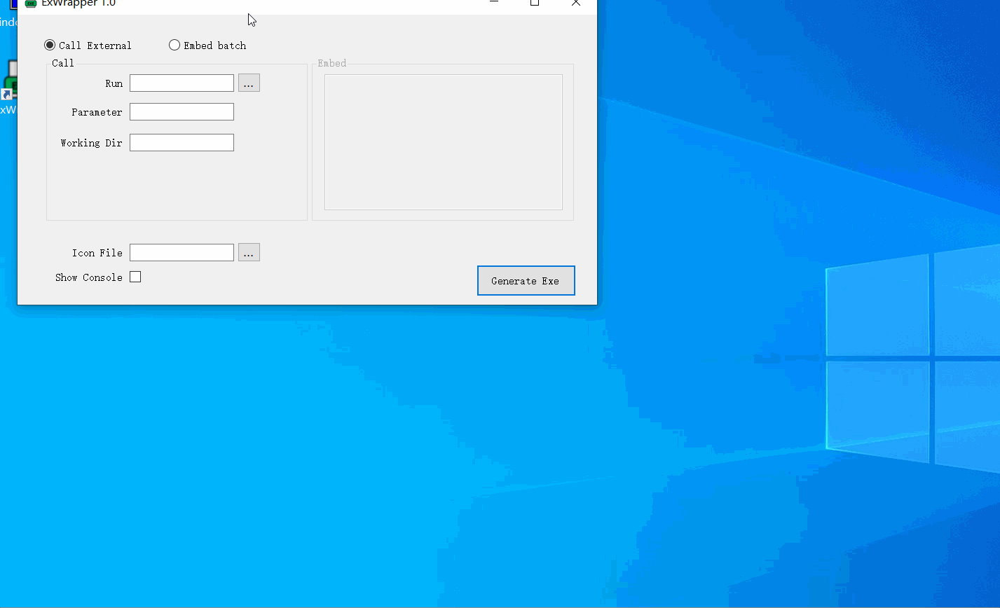

# ExWrapper
A Windows exe wrapper for launch other program

## why
There are many tools for converting bat to exe, but the focus of ExWrapper is that the exe generated by many tools will be regarded as a virus by anti-virus tools. ExWrapper uses a relatively safer method.

Features of ExWrapper:

* Supports two modes of embedding bat or calling external programs, which is more flexible.

* Very lightweight, ExWrapper is less than 50k, and the generated exe is less than 10k.

* Customize the icon and whether to display the console.